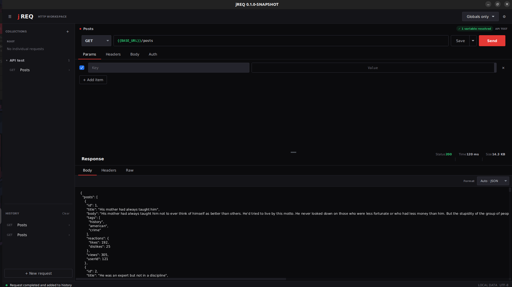

# jREQ

**A focused, local-first desktop workspace for building and testing HTTP requests.**

jREQ helps developers create, organize, send, and revisit API requests without an account, a browser runtime, or a remote workspace.

> [!NOTE]
> jREQ is under active development. The current release is intended to run from source; platform installers are not available yet.



This document is both a quick introduction to jREQ and a guide to running it from source.

- New to jREQ? Start with [What is jREQ?](#what-is-jreq) and [Getting started](#getting-started).
- Want an overview of the experience? See [Key capabilities](#key-capabilities).
- Ready to contribute? Read [Contributing](#contributing).

## Table of contents

- [What is jREQ?](#what-is-jreq)
- [Why choose jREQ?](#why-choose-jreq)
- [Key capabilities](#key-capabilities)
- [Getting started](#getting-started)
- [Using jREQ](#using-jreq)
- [Keyboard shortcuts](#keyboard-shortcuts)
- [Local data and privacy](#local-data-and-privacy)
- [Current limitations](#current-limitations)
- [Build and test](#build-and-test)
- [Contributing](#contributing)
- [License](#license)

## What is jREQ?

jREQ is a native desktop HTTP client designed around a compact request-and-response workflow. It keeps collections, environments, and request history on your machine so you can work with APIs without creating an account or sending workspace data to an application backend.

Use jREQ to:

- Explore and debug HTTP APIs.
- Build requests with query parameters, headers, and request bodies.
- Organize frequently used requests into collections.
- Reuse environment variables across endpoints.
- Inspect formatted responses and execution metadata.
- Return to previous requests through local history.

## Why choose jREQ?

- **Local-first:** your workspace remains on your computer.
- **Focused:** the interface centers on requests, responses, collections, and environments.
- **Native desktop:** send requests outside browser CORS restrictions.
- **Fast to revisit:** saved requests and recent execution history stay close at hand.
- **Readable responses:** inspect status, duration, size, headers, raw content, or formatted bodies.
- **Responsive:** compact, normal, and wide layouts adapt to the available window size.

## Key capabilities

- `GET`, `POST`, `PUT`, `PATCH`, `DELETE`, `HEAD`, and `OPTIONS` requests.
- Optional query parameters and headers that can be enabled or disabled individually.
- JSON and raw text request bodies.
- Root-level requests and collections with rename, move, duplicate, and delete actions.
- Global and collection-scoped environments using `{{variable}}` placeholders.
- Nested variable references, missing-variable feedback, and masked secret values.
- Per-request Basic Auth and JWT Bearer authentication.
- Request history for completed responses and failures.
- Automatic or manual formatting for JSON, XML, and HTML responses.
- Unsaved-change protection while navigating the workspace.

## Getting started

### Requirements

- JDK 21 or newer.
- Maven 3.9 or newer.
- A graphical desktop session.

Confirm that Java and Maven are available:

```bash
java -version
mvn -version
```

### Run from source

```bash
git clone https://github.com/GabrielAlbernaz-Dev/jreq.git
cd jreq
mvn javafx:run
```

The first run downloads the required dependencies and creates the local workspace data automatically.

## Using jREQ

### Send a request

1. Select **New request** in the sidebar.
2. Choose an HTTP method and enter a URL.
3. Add query parameters, headers, or a body when needed.
4. Select **Send** or press `Ctrl/Cmd + Enter`.
5. Inspect the response body, headers, raw content, status, duration, and size.

### Save and organize requests

Use **Save** to keep the current request at the workspace root or inside a collection. Saved requests can be renamed, moved, duplicated, or deleted from the sidebar.

Collections are flat in the current release. Deleting a collection can either move its requests to the root or remove them with the collection.

### Use environments

Create global or collection-scoped environments and reference their values with double braces:

```text
{{base_url}}/users
```

Variables can be used in URLs, parameter values, header values, and JSON or text bodies. jREQ highlights resolved references and reports missing or cyclic references before sending a request.

### Authenticate requests

Open the **Auth** tab to select one of the supported per-request methods:

- **Basic Auth** accepts a username and password and generates a standard Basic `Authorization` header.
- **JWT Bearer** accepts an existing JWT and sends it as `Authorization: Bearer <token>`.

Authentication fields support `{{variable}}` references. Passwords and tokens are masked by default in the editor. When an Auth method is active, its generated value takes precedence over any manual `Authorization` entry in the **Headers** tab; the manual entry remains part of the saved request and becomes active again if Auth is changed to **None**.

### Revisit history

Completed request attempts are added to local history, including transport and response failures. Open an entry to inspect its recorded request and response, then save it if it should become part of the workspace.

## Keyboard shortcuts

| Action | Windows/Linux | macOS |
| --- | --- | --- |
| Send request | `Ctrl + Enter` | `Cmd + Enter` |
| Toggle sidebar | `Ctrl + B` | `Cmd + B` |
| Save | `Ctrl + S` | `Cmd + S` |
| Save to a destination | `Ctrl + Shift + S` | `Cmd + Shift + S` |

## Local data and privacy

jREQ does not require an account and does not use an application backend. Workspace data stays on your machine, and HTTP requests are sent directly from the desktop application to the destination you enter.

Values marked as secret, Basic passwords, and JWT tokens are masked in the interface, but they remain unencrypted in your local workspace data. Treat that data as sensitive and avoid sharing it publicly.

## Current limitations

JWT generation and signing, OAuth, API-key helpers, authentication inheritance, import and export, nested collections, and packaged installers are not available yet.

## Build and test

Run the test suite:

```bash
mvn clean test
```

Build the project:

```bash
mvn clean package
```

The generated JAR is a project artifact, not a standalone desktop distribution. Use `mvn javafx:run` to launch jREQ from source.

## Contributing

Issues and focused pull requests are welcome while jREQ is taking shape.

1. Open an issue describing the behavior, motivation, and expected result.
2. Fork the repository and create a focused branch.
3. Add or update tests for changed behavior.
4. Run `mvn clean test` and `mvn clean package` before opening a pull request.

When reporting a bug, include your operating system, JDK version, reproduction steps, expected behavior, and the relevant error output. Remove credentials, tokens, cookies, and sensitive request data before sharing logs or screenshots.

Use the [GitHub issue tracker](https://github.com/GabrielAlbernaz-Dev/jreq/issues) for bugs, ideas, and feature requests.

## License

A project license has not been selected yet. Until a license is added, the repository does not grant general permission to copy, modify, or redistribute the code.
